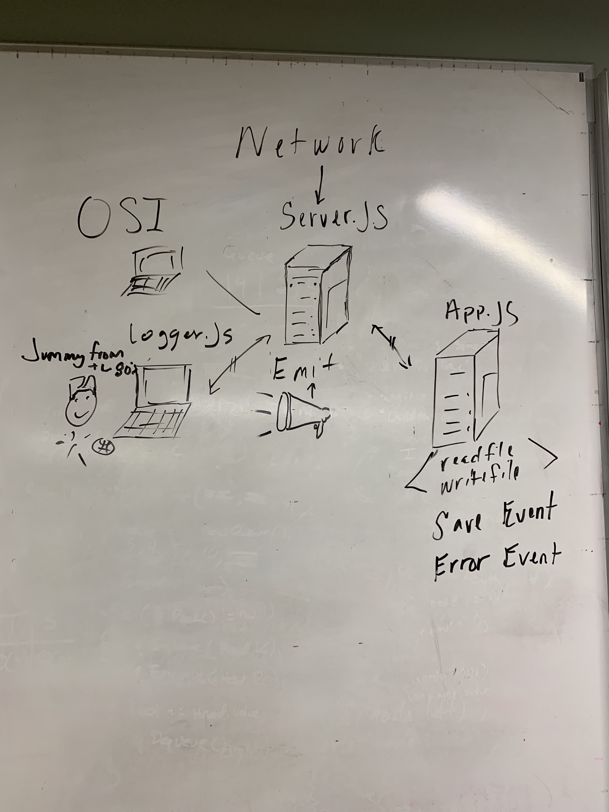

# LAB - 18

## Socket-io

### Author: Brad Smialek

### Links and Resources
* [submission PR](https://github.com/brad-smialek-401-advanced-javascript/class-lab-18-socket-io)
* [travis]()
 

### Modules
#### `app.js`
#### `server.js`
#### `logger.js`
#### `read-write-upper.js`
#### `test.txt`

* `alterFile = (file) =>`
  *
* `dispatchEvent = (buffer) =>`
  *

###  Server Setup
* `PORT` - 3000 server.js

#### Running the app
* `node server.js` 
  * spins up local server // First
* `node logger.js` 
  * spins up logger // second
* `node app.js files/test.txt`
  * tells app to run and passes file 

#### Tests
*  npm test in the terminal using jest

#### UML

